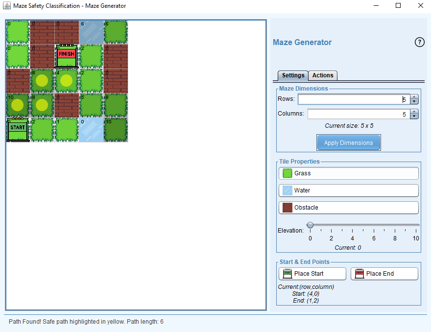
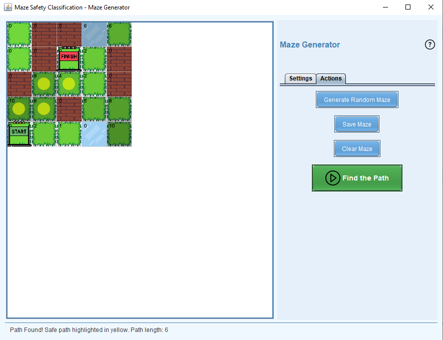

# MazePathfinderAI - Intelligent Path Planning with Perceptron & A*


---

An intelligent Java-based maze-solving application that integrates a Perceptron classifier to label terrain as safe or unsafe and applies the A* algorithm to find the most efficient path. Designed with a Java Swing GUI for interactive simulation and terrain customization.

<div align="center">
  
  
</div>

---
---

## 🌟 Key Features

- 🏗️ **Dynamic Maze Generation**
  - Configurable grid sizes (5×5 to 50×50)
  - Multiple terrain types (Grass, Water, Obstacles)
  - Adjustable elevation levels (0–10)

- 🤖 **Machine Learning Integration**
  - Perceptron classifier (100% accuracy)
  - Features:
    - Terrain type (Grass=0, Water=1)
    - Elevation (0–10)
    - Manhattan distance to nearest obstacle
  - Real-time safety classification

- 🛣️ **Advanced Pathfinding**
  - A* algorithm with safety constraints
  - Manhattan distance heuristic
  - Path optimization around unsafe tiles

- 🖥️ **Interactive GUI**
  - Intuitive tile editing
  - Start/end point placement
  - Visual path highlighting
  - Performance metrics display

---

## 📋 Project Documentation

📄 [Complete Project Requirements](resources/Project_Requirements.pdf)  
📊 [Full Training Dataset](resources/Data.xlsx)

---

## 🛠️ NetBeans Setup

1. **Import Project**  
   - File → Open Project → Select project folder  
   - 🔧 **Requires Java 17+**  
   - Ensure Java 17 is configured in project properties  

2. **Run Configuration**  
   - Right-click project → Run  
   - Main class: `com.mycompany.aiproject.AIproject`  

3. **Dependencies**  
   - Apache POI (already included)  
   - No additional libraries needed  

---

## 📦 Project Structure


```
## 📦 Project Structure

MazePathfinderAI/
├── src/
│   └── main/
│       ├── java/
│       │   └── com/
│       │       └── mycompany/
│       │           └── aiproject/
│       │               ├── AIproject.java        # Main application entry point
│       │               ├── MazeGUI.java          # Swing-based graphical interface
│       │               ├── MazePathfinder.java   # A* pathfinding logic
│       │               ├── MazePerceptron.java   # Perceptron classifier logic
│       │               └── PathfindingTest.java  # Unit tests and path validation
│       └── resources/
│           ├── Data.xlsx             # Training data
│           ├── end.png               # Endpoint icon
│           ├── execute.png           # Execute button icon
│           ├── grass.png             # Grass terrain icon
│           ├── help.png              # Help button icon
│           ├── obstacle.png          # Obstacle icon
│           ├── start.png             # Start point icon
│           ├── water.png             # Water terrain icon
│           └── Project_Requirements.pdf  # Specification document
├── target/
│   └── resources/
│       ├── Data.xlsx                 # Training data (post-build)
│       └── Project_Requirements.pdf  # Requirements PDF (post-build)
├── screenshots/
│   ├── maze_gui1.png                 # Main UI screenshot
│   └── maze_gui2.png                 # Pathfinding result screenshot
├── pom.xml                           # Maven build configuration
└── README.md                         # Project documentation

```

---

## 🚀 Quick Start

1. **Run the GUI**:
   - Set maze dimensions (5x5 to 50x50)
   - Place start/end points
   - Customize terrain types
   - Click "Find Path" to execute


---

## 📊 Performance Metrics

| Metric                  | Value     |
|-------------------------|-----------|
| Classification Accuracy | 100.00%   |
| Training Epochs         | 13        |
| Max Maze Size           | 50x50     |
| Path Calculation Time   | <200ms    |

---


<div align="center">
  <a href="resources/Project_Requirements.pdf">📄 Project Requirements</a> | 
  <a href="resources/Data.xlsx">📊 Training Dataset</a>
</div>
